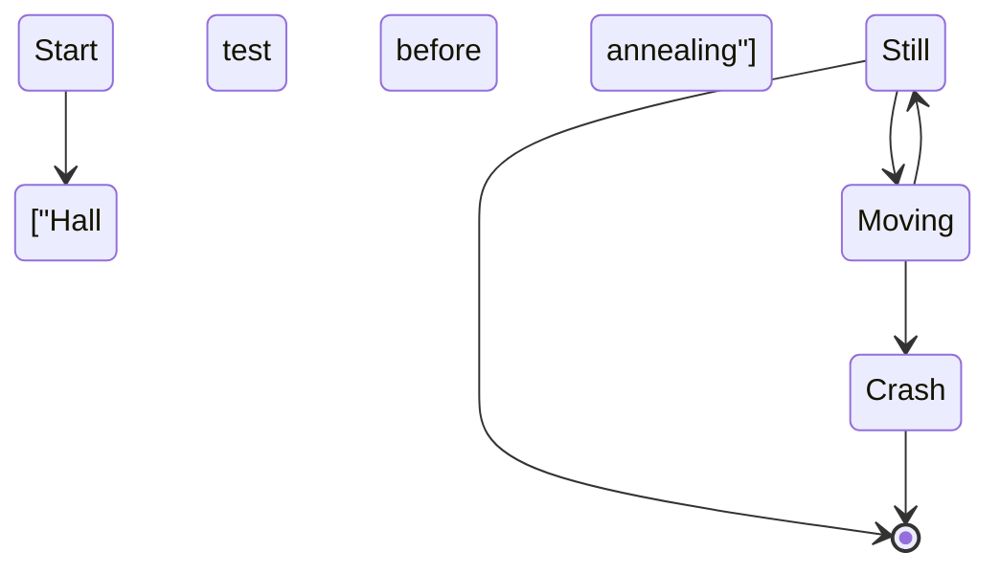

# InSe-76 Flow Diagram


```flow
st=>start: Start
op1=>operation: Annealing
op2=>operation: n-doping
op3=>operation: p-doping
cond=>condition: Yes or No?
e=>end

st->op1->op2->op3->e
cond(yes)->e
cond(no)->op1

```



