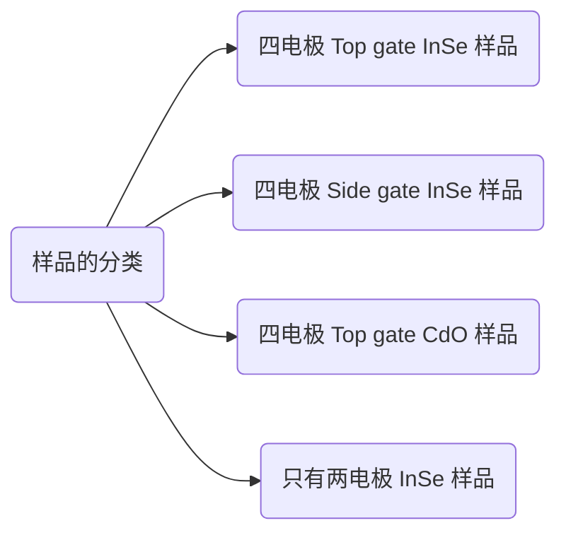
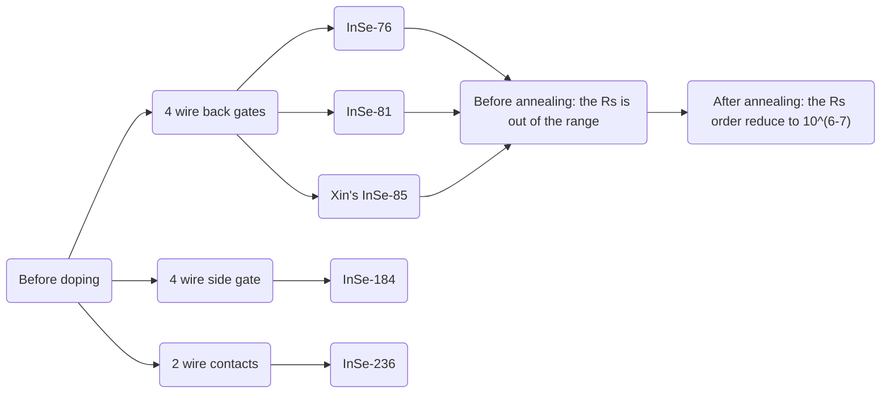

# 桌面记事本

```mermaid
graph LR
1(样品的分类)-->2("四电极 Top gate InSe 样品")
1-->3("四电极 Side gate InSe 样品")
1-->4("四电极 Top gate CdO 样品")
1-->5("只有两电极 InSe 样品")
```

---

```mermaid
graph LR
1(Before doping)-->2("4 wire back gates")
2-->3("InSe-76")
2-->4("InSe-81")
2-->9("Xin's InSe-85")
1-->5("4 wire side gate")
5-->6("InSe-184")
1-->7("2 wire contacts")
7-->8("InSe-236")
3-->10("Before annealing: the Rs is out of the range")
4-->10
9-->10
10-->11("After annealing: the Rs order reduce to 10^(6-7)")

```
