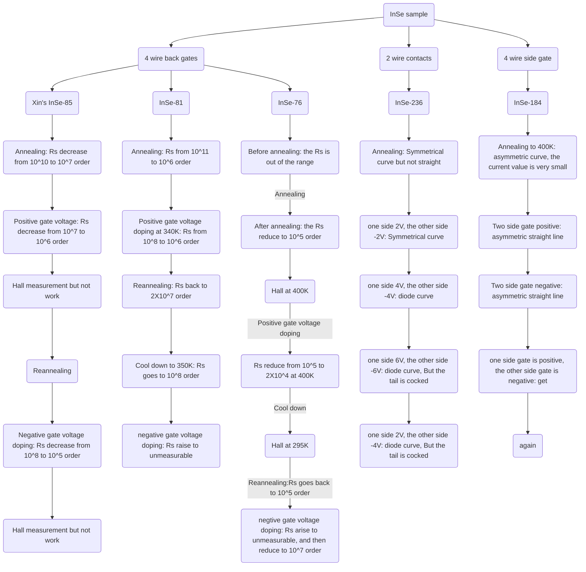

# 桌面记事本

---

```mermaid
graph TB
1(InSe sample)-->2("4 wire back gates")
2-->9("Xin's InSe-85")
2-->3("InSe-76")
2-->4("InSe-81")
1-->5("4 wire side gate")
5-->6("InSe-184")
1-->7("2 wire contacts")
7-->8("InSe-236")
3-->10("Before annealing: the Rs is out of the range")
10--"Annealing"-->11("After annealing: the Rs reduce to 10^5 order")
11-->12("Hall at 400K")
12--Positive gate voltage doping-->13("Rs reduce from 10^5 to 2X10^4 at 400K")
13--Cool down-->14("Hall at 295K")
14--Reannealing:Rs goes back to 10^5 order-->15("negtive gate voltage doping: Rs arise to unmeasurable, and then reduce to 10^7 order")
4-->16("Annealing: Rs from 10^11 to 10^6 order")
16-->17("Positive gate voltage doping at 340K: Rs from 10^8 to 10^6 order")
17-->18("Reannealing: Rs back to 2X10^7 order")
18-->19("Cool down to 350K: Rs goes to 10^8 order")
19-->20("negative gate voltage doping: Rs raise to unmeasurable")
9-->21("Annealing: Rs decrease from 10^10 to 10^7 order")
21-->22("Positive gate voltage: Rs decrease from 10^7 to 10^6 order")
22-->23("Hall measurement but not work")
23-->24("Reannealing")
24-->25("Negative gate voltage doping: Rs decrease from 10^8 to 10^5 order")
25-->26("Hall measurement but not work")
8-->27("Annealing: Symmetrical curve but not straight")
27-->28("one side 2V, the other side -2V: Symmetrical curve")
28-->29("one side 4V, the other side -4V: diode curve")
29-->30("one side 6V, the other side -6V: diode curve, But the tail is cocked")
30-->31("one side 2V, the other side -4V: diode curve, But the tail is cocked")
6-->32("Annealing to 400K: asymmetric curve, the current value is very small")
32-->33("Two side gate positive: asymmetric straight line")
33-->34("Two side gate negative: asymmetric straight line")
34-->35("one side gate is positive, the other side gate is negative: get")
35-->36("again")
```
