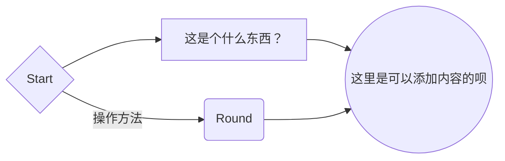

<!--paginate: true-->

# 如何使用 Markdown Mermaid 功能

---

## Markdown

**Markdown** 是如今十分流行的一种轻量级标记语言，它允许人们使用易读易写的纯文本格式编写文档。

在 **Markdown** 的使用过程中，可以使用 **Mermaid** 命令语句，通过一些[简单的文本](https://www.jianshu.com/p/e3901c57b596)输入，实现类似于 Visio 的图表功能。

---

### 流程图

